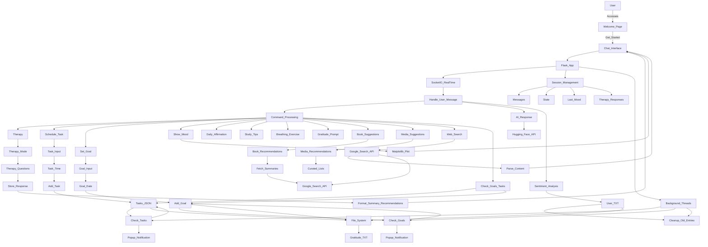

#  Anchor AI: Mental Health Assistant for Students

   

<table>
  <tr>
    <td></td>
    <td></td>
  </tr>
  <tr>
    <td></td>
    <td></td>
  </tr>
</table>

## Introduction

Anchor AI is an empathetic, AI-powered mental health assistant designed specifically for students. It provides a safe and supportive space where users can check in on their mental well-being, manage tasks and goals, receive personalized recommendations, and engage in therapeutic conversations. With a strong focus on privacy, positivity, and accessibility, Anchor AI leverages natural language processing and real-time interactions to deliver encouragement, mood tracking, and practical tools for daily life management.

**Important Disclaimer:** Anchor AI is not intended to replace professional mental health care. It serves only as a supportive, non-clinical tool. If you are experiencing a mental health crisis, please seek help from a licensed professional or emergency services.
## Project Structure

The project is organized as follows:
```
anchor-ai/
├── app.py                # Main Flask application
├── templates/
│   ├── welcome.html      # Welcome page template
│   └── index.html        # Chat interface template
├── tasks.json            # Task storage (auto-generated)
├── goals.json            # Goal storage (auto-generated)
|── last_reset.txt        #last reset data
├── user.txt              # Mood logs
├── gratitude.txt         # Gratitude entries
|── vercel.json
├── README.md             # Documentation
└── .env                  # Environment variables (excluded from version control)
```
## Features

Anchor AI offers a comprehensive set of features that address both student mental health and productivity. Its core mental health tools include check-ins that gently ask about mood, emotions, and daily experiences at the beginning of sessions. A specialized therapy mode can be activated by typing "therapy start," which initiates structured, psychiatrist-like conversations with deeper questions regarding stressors, sleep, relationships, and coping mechanisms. Each session concludes with a summary and personalized recommendations, such as meditation practices, self-care suggestions, or referrals to professional support. The platform also integrates mood tracking and analysis, using NLTK’s VADER sentiment analyzer to log moods and generate visual trend plots over the previous 48 hours. In addition, students can benefit from daily affirmations, guided 4-4-4 breathing exercises, and gratitude prompts that encourage listing three things they are thankful for, which are stored for future reflection.

Alongside mental health features, Anchor AI includes productivity and goal management tools. The task scheduler allows users to add, view, and remove tasks with reminders sent an hour before and at the due time. A maximum of ten tasks are supported, with the oldest being removed if the limit is exceeded. Similarly, the goal tracker enables students to set deadlines and receive reminders both one day before and on the deadline itself, with a maximum of ten goals stored at a time. Study tips are also provided, tailored to the user’s mood, which can include strategies such as the Pomodoro technique or visualization exercises to improve learning efficiency.

To personalize the user experience further, Anchor AI recommends resources such as **books, songs, movies, and motivational videos** that are aligned with the user’s mood. For example, students in a positive mood may receive recommendations such as "The Power of Positive Thinking." Summaries for books are obtained through web searches, while songs, videos, and movies include direct YouTube links. The system also integrates web search functionality, allowing students to append the word "search" to a query in order to retrieve and summarize top results via the Google Custom Search API.

The technical design of Anchor AI prioritizes user experience. It provides real-time chat powered by Flask-SocketIO, ensuring interactive, websocket-based conversations. The AI responses are generated through Hugging Face’s InferenceClient with the Gemma-2-9b-it model, offering natural and empathetic replies. Task and goal reminders appear as popup notifications, while all user data such as moods, tasks, goals, and gratitude logs are stored in JSON or TXT files to ensure persistence. Shared URLs are previewed by fetching titles, descriptions, and images, and background threads handle periodic checks, reminders, and data cleanup tasks automatically.

---

## Complete system Flowchart

As you can see here, the complete diagram provides a high-level overview while also capturing the detailed interactions between different components. This makes it much easier to understand the overall project architecture, the flow of data, and how each module communicates with the others.



## Technologies Used

| Technology | Description |
|------------|-------------|
| Python 3 | Core programming language for the backend. |
| Flask | Web framework for building the application. |
| Flask-SocketIO | Real-time bidirectional communication. |
| Hugging Face (Gemma-2-9b-it) | AI model for natural language responses. |
| NLTK | Natural Language Toolkit for sentiment analysis. |
| Matplotlib | Data visualization for mood trend plots. |
| Requests & BeautifulSoup | Web scraping and HTTP requests. |
| Google Custom Search API | For web search integration. |
| HTML, CSS, JS, Tailwind CSS | For building the web user interface. |


The project is implemented using Python 3 with Flask and Flask-SocketIO forming the backbone of the application. Natural language processing and AI responses are powered by Hugging Face’s Gemma-2-9b-it model in combination with NLTK for sentiment analysis. Data visualization is handled through Matplotlib, which is used to generate mood trend plots. For web scraping and search capabilities, the project employs BeautifulSoup, Requests, and the Google Custom Search API. Additional libraries include datetime, json, base64, threading, random, and os for data handling and background processing. On the frontend, HTML, CSS, and JavaScript are used with Jinja2 templates and Font Awesome icons to create a clean and interactive user interface. The application does not require a database, relying instead on lightweight file-based storage using JSON and TXT files.

## Installation

To set up the project locally, begin by cloning the repository:

```bash
git clone https://github.com/yourusername/anchor-ai.git
cd anchor-ai
```

Next, create a virtual environment. On Linux or macOS, run:
```bash
python -m venv venv
source venv/bin/activate
```
Once the environment is active, install the required dependencies:
```bash
pip install requirements.txt
```


## Usage

On the welcome page, users can click "Get Started" to open the chat interface. Within the chat, they can interact naturally with Anchor AI or use commands such as "therapy start" to begin a structured session, "stop therapy" to end it, "schedule my work" to add tasks, "set goal" to define goals, "daily affirmation", "study tips", "breathing exercise", "gratitude", "suggest songs/movies/videos/music", "book suggest", "show my mood analysis", and "check goals/tasks". Appending "search" to a query will initiate a web search. The sidebar provides quick access to mood analysis, affirmations, exercises, and study tips. Task and goal notifications appear as popups, and all data is saved to files (user.txt, tasks.json, goals.json, and gratitude.txt). Data older than 48 hours is automatically removed.

## Contributing

Contributions to Anchor AI are welcome. To contribute, fork the repository and create a feature branch using git checkout -b feature/YourFeature. Commit your changes with git commit -m 'Add YourFeature', push to your branch with git push origin feature/YourFeature, and open a Pull Request. Contributors are encouraged to focus on ethical AI practices, privacy, and mental health sensitivity, and to include tests where possible.


## Acknowledgments
Anchor AI was built using open-source tools from Hugging Face, NLTK, Flask, and other contributors. It was inspired by the growing need for accessible and empathetic mental health support tailored to students.
For questions or suggestions, please open an issue on the repository or contact us through our GitHub profile.

 
